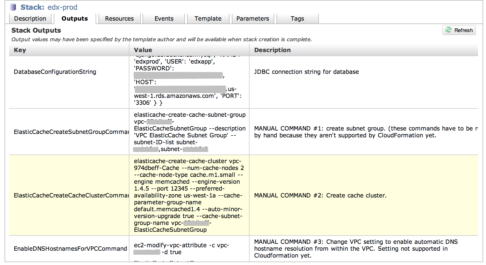

# Configuration Management

## Introduction

**This project is currently in alpha**

The goal of the edx/configuration project is to provide a simple, but
flexible, way for anyone to stand up an instance of the edX platform
that is fully configured and ready-to-go.

Building the platform takes place to two phases:

* Infrastruce provisioning
* Service configuration

As much as possible, we have tried to keep a clean distinction between
provisioning and configuration.  You are not obliged to use our tools
and are free to use one, but not the other.  The provisioing phase 
stands-up the required resources and tags them with role identifiers
so that the configuration tool can come in and complete the job.

The reference platform is provisioned using an Amazon
[CloudFormation](http://aws.amazon.com/cloudformation/) template.
When the stack has been fully created you will have a new AWS Virtual
Private Cloud with hosts for the core edX services.  This template
will build quite a number of AWS resources that cost money, so please
consider this before you start.

The configuration phase is manged by [Ansible](http://ansible.cc/).
We have provided a number of playbooks that will configure each of
the edX service.  

This project is a re-write of the current edX provisioning and
configuration tools, we will be migrating features to this project
over time, so expect frequent changes.

## AWS

### Quick start - Building the stack on a single server


To deploy the entire edX platform on a single ec2 instance
run the following commands:

```
git clone git@github.com:edx/configuration
mkvirtualenv ansible
cd configuration
pip install -r ansible-requirements.txt
cd playbooks
(adjust the settings in edx_sandbox.yml)
`ansible-playbook  -vvv --user=ubuntu edx_sandbox.yml -i inventory.ini -e 'secure_dir=secure_example`
```

This will install the following services on a single instance

* edX lms (django/python) for courseware
* edX studio (django/python) for course authoring
* mysql (running locally)
* mongo (running locally)
* memcache (running locally)

Note: In order for mail to work properly you will need to add AWS credentials for an account that
has SES permissions, see `secure\_example/vars/edxapp\_sandbox.yml`

### Building the stack with CloudFormation

The first step is to provision the CloudFormation stack.  There are 
several options for doing this.

* The [AWS console](https://console.aws.amazon.com/cloudformation/home)
* The AWS [CloudFormation CLI](http://docs.aws.amazon.com/AWSCloudFormation/latest/UserGuide/cfn-installing-cli.html)
* Via Ansible

If you don't have experience with CloudFormation, the web console is a
good place to start because it will use a form wizard to gather
configuration parameters, it will give you continuous feedback during
the process of building the stack and useful error messages when
problems occur.

Before you create the stack you will need to create a key-pair that can
be used to connect to the stack once it's instantiated.  To do this
go to the 'EC2' section and create a new key-pair under the 'Key Pairs'
section.  Note the name of this key and update
`cloudformation_templates/edx-reference-architecture.json` file.  Under the
'KeyName' section change the value of 'Default' to the name of the key-pair
you just created.

Details on how to build the stack using Ansible are available below.

#### Building with the AWS Console
From the AWS main page that lists all the services you can use.  Click on the
CloudFormation link.  This will take you to a list of cloud stacks you currently
have active.  Here click the 'Create Stack' button.  In the wizard you can give a
name for your stack and pass in a template which defines the edX stack.  Use the
`edx-reference-architecture.json` template in the `cloudformation_templates` directory.

#### Building with the CloudFormation CLI
To build from the CloudFormation CLI you will have to first upload the configuration
file to an S3 Bucket.  The easiest way to do this is to use `s3cmd`.

```
s3cmd put /path/to/edx-reference-architecture.json s3://<bucket_name>
aws cloudformation create-stack --stack-name <stack_name> --template-url https://s3.amazonaws.com/<bucket_name>/edx-reference-architecture.json --capabilities CAPABILITY_IAM
```

### Post Bringup Manual Commands

Unfortunately there is some infrastructure that we need that is currently not supported
by CloudFormation.  So once your stack is created by CloudFormation you need to run
a few manual commands to fill in those gaps.

This requires that you've installed the command line utilities for [ElastiCache][cachecli]
and [EC2][ec2cli].  Note that we requrire at least version 1.8 of the ElastiCache CLI due
to some newer commands that we rely on.

  [cachecli]: http://aws.amazon.com/developertools/2310261897259567
  [ec2cli]: http://aws.amazon.com/developertools/351

At the end of the CloudFormation run you should check the "Outputs" tab in
Amazon UI and that will have the commands you need to run (see
screenshot).



Run the commands shown here before moving onto the next step.

### Connecting to Hosts in the Stack

Because the reference architecture makes use of an Amazon VPC, you will not be able
to address the hosts in the private subnets directly.  However, you can easily set 
up a transparent "jumpbox" so that for all hosts in your vpc, connections are 
tunneled.

Add something like the following to your `~/.ssh/config` file.

```
Host *.us-west-1.compute-internal
  ProxyCommand ssh -W %h:%p vpc-us-west-1-jumpbox
  ForwardAgent yes

Host vpc-us-west-1-jumpbox
  HostName 54.236.202.101
  ForwardAgent yes
```

This assumes that you only have one VPC in the ```us-west-1``` region
that you're trying to ssh into.  Internal DNS names aren't qualified
any further than that, so to support multiple VPC's you'd have to get
creative with subnets, for example ip-10-1 and ip-10-2...

Test this by typing `ssh ip-10-0-10-1.us-west-1.compute.internal`, 
(of course using a hostname exists in your environment.)  If things 
are configured correctly you will ssh to 10.0.10.1, jumping 
transparently via your basion host.

Getting this working in important because we'll be using Ansible
with the SSH transport and it will rely on this configuration
being in place in order to configure your servers.


### Finding your hosts via boto

Boto is how fabric looks up metadata about your stack, most importantly
finding the names of your machines.  It needs your access information.
This should be the contents of your ```~/.boto``` file.  Make sure
to customize the region:

```ini
[Credentials]
aws_access_key_id = AAAAAAAAAAAAAAAAAAAA
aws_secret_access_key = BBBBBBBBBBBBBBBBBBBBBBBBBBBBBBBBBBBBBBBB

[Boto]
debug = 1
ec2_region_name = us-west-1
ec2_region_endpoint = ec2.us-west-1.amazonaws.com
```


### Tagging

Tagging is the bridge between the provisioning and configuration
phases.  The servers provisioned in your VPC will be stock Ubuntu
12.0.4 LTS servers.  The only difference between them will be the tags
that CloudFront has applied to them.  These tags will be used by Ansible
to map playbooks to the correct servers.  The application of the
appropriate playbook, will turn each stock host into an appropriately
configured service.

The *Group* tag is where the magic happens.  Every AWS EC2 instance
will have a *Group* tag that corresponds to a group of machines that
need to be deployed/targeted to as a group of servers.

**Example:**
* `Group`: `edxapp_stage`
* `Group`: `edxapp_prod`
* `Group`: `edxapp_some_other_environment`
 
Additional tags can be added to AWS resources in the stack but they should not
be made necessary deployment or configuration.

## Ansible

Ansible is a configuration management tool that edX is evaluating to replace
the puppet environment that is currently being used for edX servers.

http://ansible.cc/docs

_Note: Because the directory structure changes in v1.2 we are using the dev
version instead of the official v1.1 release._


* __Hosts__ -  The ec2.py inventory script generates an inventory file where
  hosts are assigned to groups. Individual hosts can be targeted by the "Name"
  tag or the instance ID. I don't think there will be a reason to set host
  specific variables.
* __Groups__ - A Group name is an identifier that corresponds to a group of
  roles plus an identifier for the environment.  Example: *edxapp_stage*,
  *edxapp_prod*, *xserver_stage*, etc.  For the purpose of targeting servers
  for deployment groups are created automatically by the `ec2.py` inventory
  script since these group names will map to the _Group_ AWS tag. 
* __Roles__  - A role will map to a single function/service that runs on
  server.

## Organization

### Secure vs. Insecure data

As a general policy we want to protect the following data:

* Usernames
* Public keys (keys are OK to be public, but can be used to figure out usernames)
* Hostnames
* Passwords, API keys

The following yml files and examples serve as templates that should be overridden with your own
environment specific configuration:

* vars in `secure_example/vars` 
* files in `secure_example/files` 

Directory structure for the secure repository:

```

ansible
├── files
├── keys
└── vars

```

The same directory structure, required yml files and files are 
in the secure_example dir:

```
secure_example/
├── files
├── keys
└── vars
```

The default `secure_dir` is set in `group_vars/all` and can be overridden by
adding another file in group_vars that corresponds to a deploy group name.


The directory structure should follow Ansible best practices.

http://ansible.cc/docs/bestpractices.html

* At the top level there are yml files for every group where a group name is an
  identifier that corresponds to a set of roles plus an environment.  
* The standard environments are _stage_ and _production_.
* Additional environments can be named as well, below an example is given
  called _custom_.


### Variables

* The ansible.cfg that is checked into the playbook directory has hash merging
  turned on, this allows us to to merge secure and custom data into the default
  variable definitions for every role.
* For example, `vars/lms_vars.yml` (variables needed for the lms role) sets the
  `env_config` which has keys that can be overridden by
  `vars/secure/edxapp_stage_vars.yml` for setting passwords and hostnames.  
* If needed, additional configuration can be layered, in the example
  `vars/secure/custom_vars.yml` changes some paramters that are set in
  `vars/secure/edxapp_stage_vars.yml`.

__TODO__: _The secure/ directories are checked into the public repo for now as an
example, these will need to be moved to a private repo or maintained outside of
github._

### Users and Groups

There are two classes of users, admins and environment users.

* The *admin_users* hash will be added to every server and will be put into a
  group that has admin bits.
* The *env_users* hash are the class of users that can be optionally included
  in one of the group-environment playbooks.


Example users are in the `vars/secure` directory:

* [*env_users* for staging environment](/vars/secure/edxapp_stage_users.yml)
* [*admin_users* will be realized on every server](/vars/secure/users.yml)


```
cloudformation_templates  <-- official edX cloudformation templates
    └── examples          <-- example templates
playbooks
 └──
     edxapp_prod.yml      <-- example production environment playbook
     edxapp_stage.yml     <-- example stage environment playbook
     edxapp_custom.yml    <-- example custom environment playbook
    ├── files             <-- edX cloudformation templates
    │   └── examples      <-- example cloudformation templates
    ├── group_vars        <-- var files that correspond to ansible group names (mapped to AWS tags)
    ├── keys              <-- public keys
    ├── roles             <-- edX services
    │   ├── common        <-- tasks that are run for all roles
    │   │   └── tasks
    │   ├── lms
    │   │   ├── tasks     <-- tasks that are run to setup an LMS
    │   │   ├── templates
    │   │   └── vars      <-- main.yml in this directory is auto-loaded when the role is included
    │   │
    │   └── nginx
    │       ├── handlers 
    │       ├── tasks
    │       ├── vars
    │       └── templates 
    │   (etc)
    └── vars             <-- public variable definitions
    └── secure_example   <-- secure variables (example)

```


### Installation

```
  mkvirtualenv ansible
  pip install -r ansible-requirements.txt
  util/sync_hooks.sh
```

### Launching example cloudformation stack - Working example

#### Provision the stack

**This assumes that you have workng ssh as described above**

  ```
  cd playbooks
  ansible-playbook  -vvv cloudformation.yml -i inventory.ini  -e 'region=<aws_region> key=<key_name> name=<stack_name> group=<group_name>'
  ```
  
* _aws_region_: example: `us-east-1`. Which AWS EC2 region to build stack in.
* _key_name_: example: `deploy`. SSH key name configured in AWS for the region
* _stack_name_: example: `EdxAppCustom`. Name of the stack, must not contain
  underscores or cloudformation will complain. Must be an unused name or
  otherwise the existing stack will update.
* _group_name_: example: `edxapp_stage`. The group name should correspond to
  one of the yml files in the `playbooks/`. Used for grouping hosts.

While this is running you see the cloudformation events in the AWS console as
the stack is brought up.  Loads the `playbooks/cloudformation.yml` template
which creates a single small EBS backed EC2 instance.  

_Note: You should read the output from ansible and not necessarily trust the
'ok'; failures in cloudformation provisioning (for example, in creating the
security group), may not cause ansible-playbook to fail._

See files/examples for
adding other components to the stack.

##### If ansible-playbook gives you import errors

Ansible really wants to call /usr/bin/python and if you have good virtualenv
hygeine, this may lead to ansible being unable to import critical libraries
like cloudfront. If you run into this problem, try exporting PYTHONPATH inside
your virtualenv and see if it runs better that way. E.g.:

  ```
  export PYTHONPATH=$VIRTUAL_ENV/lib/python2.7/site-packages/ 
  ansible-playbook playbooks/cloudformation.yml -i playbooks/inventory.ini
  ```

If that works fine, then you can add an export of PYTHONPATH to
`$VIRTUAL_ENV/bin/postactivate` so that you no longer have to think about it.
  
### Configure the stack

* Creates admin and env users
* Creates base directories
* Creates the lms json configuration files


Assuming that the edxapp_stage.yml playbook targets hosts in your vpc
for which there are entiries in your `.ssh/config`, do the 
following to run your playbook.

```
  cd playbooks
  ansible-playbook -v --user=ubuntu edxapp_stage.yml -i ./ec2.py -c ssh
```

*Note: this assumes the group used for the edx stack was "edxapp_stage"*


